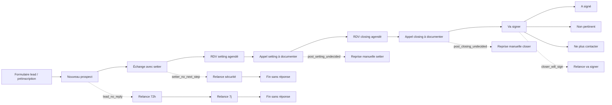

# Sales Cockpit - Graphe Parcours / Flux / Actions

Cette spec formalise l'image `C:\Users\FD\Desktop\SC logic.png` et la logique décrite par François.

Objectif : donner à l'équipe une représentation compréhensible du système, puis s'en servir pour expliquer les règles métier et sécuriser les tests.

Prompt IA prêt à copier-coller pour générer une image exhaustive : `docs/WORKFLOW_GRAPH_IMAGE_PROMPT.md`.

## Modèle Mental

Le système se lit comme une arête principale, orientée dans le temps.

- Départ : formulaire site web, lead ou préinscription.
- Conversation ouverte : tant qu'une action commerciale reste à faire.
- Parcours : états métier successifs sur l'arête principale.
- Flux : scénarios latéraux attachés à un état du parcours.
- Actions : étapes ordonnées à l'intérieur d'un flux.
- Conversation fermée : lorsqu'un état terminal est atteint ou qu'un flux arrive à sa fin sans réponse.

## Parcours Principal

Les états à représenter sur l'axe principal V1 :

1. Nouveau prospect.
2. Échange avec setter.
3. Rendez-vous setting agendé.
4. Appel setting à documenter.
5. Rendez-vous closing agendé.
6. Appel closing à documenter.
7. Va signer.
8. États terminaux.

États terminaux principaux :

- A signé.
- Non pertinent.
- Ne plus contacter.
- Flux terminé sans réponse.
- Traité ailleurs / clôture manuelle contrôlée.

Un état terminal ferme la conversation et doit laisser zéro action opérationnelle active.

## Flux Latéraux

Un flux est une branche attachée à un état du parcours. Il génère une ou plusieurs actions ordonnées.

Flux V1 à représenter :

- `lead_no_reply` : lead sans réponse initiale.
- `setter_no_next_step` : échange setter sans suite.
- `setting_call_not_reached` : appel setting non joint.
- `post_setting_undecided` : setting joint mais indécis.
- `closing_call_not_reached` : appel closing non joint.
- `post_closing_undecided` : closing joint mais indécis.
- `closer_will_sign` : closer estime que le prospect va signer.
- `course_start` : relances liées à l'approche du début de cours.

Chaque flux doit afficher :

- son nom métier ;
- son `sequence_code` technique ;
- son état de parcours d'ancrage ;
- ses actions ordonnées ;
- les délais ;
- le responsable typique ;
- le type d'action : relance, appel, reprise manuelle ;
- le comportement de fin : action suivante ou conversation fermée.

## Représentation Recommandée

Pour V1, la source de vérité ne doit pas être une image IA libre.

Approche recommandée :

1. Générer un graphe déterministe depuis `sequences`, `sequence_steps` et `business_rules.py`.
2. Afficher ce graphe dans `Pilotage > Logique métier`, ou dans une page `Pilotage > Graphe`.
3. Utiliser Mermaid, Graphviz ou SVG généré pour garder le schéma versionnable.
4. Autoriser ensuite une image IA uniquement comme support pédagogique ou poster, jamais comme source de vérité.

La version visuelle doit rester calme et lisible :

- axe principal horizontal ;
- flux latéraux en branches ;
- actions sous forme de points ou petits nœuds ;
- couleurs sémantiques sobres ;
- pas de décoration inutile ;
- clic ou survol sur une action pour voir la règle métier.

## Exemple Mermaid Conceptuel



Ce Mermaid n'est pas exhaustif ; il sert de squelette.

## Règle De La Croix

La croix ne signifie pas "annuler n'importe quoi".

Sens cible :

```text
Ignorer cette étape de flux.
```

Effet métier :

1. L'utilisateur confirme explicitement.
2. Une note est obligatoire.
3. L'action actuelle est marquée comme faite au sens du flux, avec outcome `sequence_step_skipped`.
4. Le système calcule la prochaine action logique du même flux.
5. Si une étape suivante existe, elle est créée selon son délai normal.
6. Si aucune étape suivante n'existe, le flux se termine et la conversation est clôturée si aucune autre action active ne subsiste.

La confirmation doit afficher ce qui va se passer ensuite :

```text
Vous allez ignorer cette étape.
Si aucun autre événement ne survient, la prochaine action sera :
<type d'action> · <responsable> · <échéance> · <flux / étape suivante>.
```

Si le système ne peut pas calculer la suite, il ne doit pas afficher la croix. Il doit proposer une action de revue humaine ou demander de choisir explicitement une prochaine action.

## Actions Skippables V1

Une action est skippable seulement si :

- la conversation est ouverte ;
- le contact n'est pas `Ne plus contacter` ;
- la qualification n'est pas terminale ;
- l'action appartient à un flux (`sequence_code` et `sequence_step_index`) ;
- l'action est encore active ;
- le type est une étape de flux :
  - `follow_up` ;
  - `manual_reprise_setter` ;
  - `manual_reprise_closer`.

La croix ne doit pas apparaître pour :

- `reply` ;
- `setting_call` ;
- `closing_call` ;
- `contact_review` ;
- `other` ;
- conversations terminées ;
- états signés, non pertinents ou ne plus contacter.

## Écart UX Actuel À Corriger

La logique backend sait déjà avancer après un skip de séquence, mais l'interface ne rend pas encore assez visible la prochaine action naturelle avant confirmation.

Correction cible :

- renommer visuellement la section en `Ignorer cette étape de flux` ;
- afficher un texte danger court ;
- afficher la prochaine action calculée avant confirmation ;
- afficher un message explicite si le flux se terminera ;
- garder la note obligatoire ;
- journaliser `Étape ignorée` et la création éventuelle de l'action suivante.

## Implication Pour Les Tests

Le protocole E2E doit tester :

1. Une relance `follow_up` skippable avec étape suivante.
2. Une reprise manuelle skippable avec étape suivante ou fin de flux.
3. Une action `reply` non skippable.
4. Un appel setting/closing non skippable via la croix.
5. Un état terminal sans croix.
6. La présence visible de la prochaine action avant confirmation.
